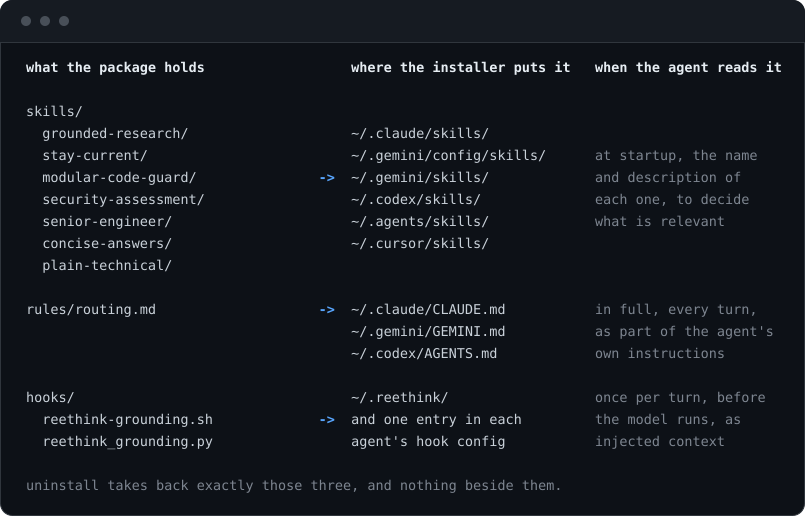

# reethink

[English](README.md) · **Bahasa Indonesia**

Delapan skill yang membuat AI coding agent memeriksa dulu sebelum menjawab, lalu
menyampaikan temuannya dengan cara yang bisa ditindaklanjuti manusia, plus
hook yang menyalakannya tanpa perlu diminta.

```sh
curl -fsSL https://raw.githubusercontent.com/masbrokemanaaja/reethink/main/install.sh | sh
```


Installer mencari agent yang sudah ada di mesin Anda, menyalin skill ke tempat
yang dibaca masing-masing, menambahkan blok routing ke file instruksinya, dan
memasang hook di agent yang mendukungnya. Restart agent-nya dan langsung
aktif, meski Claude Code terukur memungut keduanya tanpa restart. Di Codex,
pastikan hook-nya sampai: versi lama menahan hook baru untuk ditinjau sampai
Anda menyetujuinya lewat `/hooks`, dan installer mengatakannya saat menulis
entry itu.

Batalkan kapan saja dengan `sh uninstall.sh`. Semua yang ditulisnya ditandai,
dan uninstall mencabut persis itu. Satu hal yang tidak bisa dikembalikan
adalah spasi: file config JSON ditulis ulang oleh formatter, jadi kembali
dengan indentasi dua spasi, nilainya tidak berubah.

## Apa yang berubah setelah dipasang

Terukur pada sesi Antigravity sungguhan, empat pertanyaan ditanyakan sekali
dengan reethink dan sekali tanpa, model yang sama, percakapan baru tiap kali:


| Dalam empat jawaban | Dengan reethink | Tanpa |
| --- | --- | --- |
| Klaim berlabel verified, assumed, atau untested | 17 | 0 |
| Sitasi yang menyebut file dan nomor baris | 18 | 6 |
| Perintah yang benar-benar dijalankan untuk mengecek | 16 | 7 |

Setiap sitasi itu ditelusuri ulang satu per satu dan tidak ada yang dikarang.
Agent-nya mengecek lebih dari dua kali lebih sering sebelum menjawab, dan
menyebutkan bagian mana yang sudah dia periksa.

Yang tidak berubah: kedua sisi menjawab keempatnya dengan benar. Ini tidak
membuat agent yang sudah cakap jadi lebih jarang salah, dan bagian di bawah
memuat empat percobaan terpisah untuk mengukur hal itu, semuanya datar,
beserta alasannya. Klaim di sini lebih sempit dan inilah yang bertahan: Anda
bisa melihat dari mana jawabannya datang.

---

## Masalahnya

Coding agent yang salahnya kentara mudah ditangkap. Kegagalan yang mahal
adalah yang diam-diam:

- Ia menulis `client.foo()` karena nama method itu terasa benar. Library-nya
  tidak punya method itu, dan errornya baru muncul tiga langkah kemudian.
- Ia bilang versi terbaru adalah versi terbaru yang dia ingat, yang memang
  benar saat data latihnya dikumpulkan dan sekarang tertinggal dua mayor.
- Ia bilang sebuah fitur tidak ada, padahal fitur itu rilis setelah cutoff
  model.
- Ia berhenti di "saya kurang yakin, cek dokumentasinya" padahal dokumentasi
  itu tinggal satu panggilan tool.
- Ia menulis kode yang jalan tapi membuat file itu sedikit lebih sulit diubah,
  setiap kali, sampai tidak ada yang bisa menemukan letak apa pun.
- Ia mengerjakan tugasnya dengan benar, lalu mengubur satu angka yang penting
  di bawah paragraf "saya telah berhasil mengimplementasikan perubahan yang
  diminta".

Tidak satu pun dari ini masalah pengetahuan. Modelnya bisa menemukan semuanya.
Ini masalah **kebiasaan**, dan kebiasaan itulah gunanya skill.

## Skill-nya

Masing-masing berupa folder berisi `SKILL.md` dalam format [Agent Skills open
standard](https://agentskills.io), jadi bisa dimuat tool mana pun yang
kompatibel.

Lima menentukan apa yang benar. Satu menentukan bagaimana sebuah desain
terlihat dan dipakai. Dua menentukan apa yang selamat sampai ke pembaca. Pasangan kedua lebih penting dari kelihatannya: agent yang mengukur
dengan teliti lalu melaporkan "sekarang sudah jalan" telah membuang
pengukurannya di langkah terakhir.

### Menentukan apa yang benar

#### `grounded-research`

Menghentikan agent menjawab dari ingatan, sekaligus menghentikannya menyerah.

Dua kegagalan sama beratnya: mengarang API yang terdengar masuk akal tapi
tidak ada, dan berhenti di "saya kurang yakin" padahal jawabannya tinggal satu
panggilan tool. Skill ini menetapkan tangga sumber: repositori dulu, lalu
server MCP dokumentasi kalau ada, lalu sumber primer proyeknya sendiri, dengan
sumber sekunder diturunkan jadi petunjuk, bukan bukti. Ada bagian "riset tanpa
menyerah": kalau query yang jelas tidak membuahkan hasil, ganti kosakatanya,
baca implementasinya, baca changelog di sekitar versi yang dipakai, telusuri
issue tracker, dan baru setelah itu laporkan kekosongannya.

> Ketidakpastian adalah pemicu untuk pergi mencari, tidak pernah jadi alasan
> untuk berhenti atau mengembalikan pertanyaannya.

#### `stay-current`

Menghentikan agent menjawab dari horizon latih yang sudah basi.

Kesalahannya berjalan dua arah, dan arah kedua yang sering terlewat: mengaku
versi yang diingat sebagai versi sekarang, dan mengaku sesuatu tidak ada
karena rilis setelah cutoff. Ingatan itu lantai, bukan langit-langit. Skill
ini membawa perintah registry untuk npm, Go, PyPI, dan rilis GitHub, plus dua
jebakan yang ditemukan saat mengujinya: `gh api repos/.../tags` mengembalikan
tag tanpa urutan terdokumentasi dan bukan berdasarkan tanggal, jadi entri
pertamanya tidak menjawab apa pun, dan paket dengan kanal LTS mencantumkan
banyak `dist-tags` di mana hanya `dist-tags.latest` yang menjawab "terbaru".

#### `modular-code-guard`

Menjaga apa yang ditulis supaya tidak jadi spageti.

Satu tanggung jawab, unit kecil, pemisahan urusan, batas modul yang eksplisit,
arah dependensi yang menunjuk ke dalam. Ia mengikuti struktur yang sudah ada
di repositori alih-alih memaksakan yang dianggap lebih baik, membawa checklist
yang harus dijawab terhadap diff yang sebenarnya dan bukan dari ingatan, plus
bagian tentang membuktikan sebuah refactor tidak mengubah perilaku: baseline
dulu, satu tanggung jawab per langkah, jalankan ulang lalu bandingkan, dan
katakan terus terang kalau ada langkah yang belum diverifikasi.

#### `security-assessment`

Memandu audit keamanan kotak putih (white-box), triage kerentanan, dan pengerasan defensif (defensive hardening).

Dua kegagalan menggagalkan bantuan keamanan otomatis: menulis payload eksploitasi
aktif yang memicu filter keselamatan tanpa membantu pengiriman perangkat lunak,
dan menolak memeriksa kode mencurigakan karena kehati-hatian berlebih. Skill ini
mengalasi tugas keamanan pada analisis aliran data (source-to-sink taint
analysis), standar resmi CWE dan OWASP, uji regresi keamanan lokal, serta patch
remediasi konkret.

#### `senior-engineer`

Lapisan penilaian: seperti apa solusi yang baik, dan opsi mana yang memang
layak dibangun.

Intinya satu babak "berpikir di luar kotak" yang berjalan sebelum desainnya
ditetapkan: serang kebutuhannya, bukan tiketnya; tanyakan apakah masalahnya
bisa dihapus; balik pertanyaannya; geser pekerjaannya dalam waktu atau ruang;
curi dari domain lain; cari batasan yang sebenarnya palsu; dan pilih
eksperimen termurah yang bisa mematikan satu opsi. Lalu sebut dalam satu baris
opsi tidak biasa mana yang ditemukan dan kenapa diambil atau tidak, karena
solusi membosankan yang menang juga sebuah jawaban. Pagar pengamannya menjaga
kreativitas tetap di perumusan masalah dan jauh dari keamanan, penanganan
error, penamaan, dan gaya penulisan.

### Menentukan bagaimana tampilannya

Yang satu ini tidak menentukan apa yang benar atau bagaimana jawaban dibaca. Ia
menentukan seperti apa sebuah layar terlihat dan bagaimana orang melewatinya,
dan ia satu-satunya skill di sini yang mengatur hasil kerja, bukan balasan.

#### `senior-designer`

Desainer UI dan UX senior, web dan mobile, yang menolak mengirim desain
rata-rata.

AI slop adalah versi desain dari menjawab berdasarkan ingatan: minta landing
page ke sebuah model dan ia menggambar titik tengah semua landing page yang
pernah dilihatnya, hero di tengah dengan teks gradien, tiga kartu ikon, Inter.
Skill ini membagi pekerjaannya menjadi dua. Fungsi datang dari brief dan
ilmunya: arsitektur informasi, navigasi, konvensi platform, dan lantai WCAG 2.2
AA ditetapkan, tidak pernah diserahkan ke kebetulan. Ekspresi diundi oleh
`scripts/direction.py` dari sepuluh sumbu (komposisi, tipe, strategi warna,
bentuk, kedalaman, hierarki, kepadatan, citra, ikon, dan satu elemen khas),
pasangan yang saling bertabrakan dikeluarkan lewat aturan, dan skala spasi,
skala tipe, serta motion diturunkan dari hasil undian. Hasilnya 53.871.360 arah
yang valid untuk web dan 44.892.800 untuk mobile sebelum font dan palet
dihitung, ditawarkan tiga sekaligus dengan jarak enam sumbu, dan setiap seed
bisa diulang atau dihindari lain kali. Sebelum desain pertama ia bertanya
apakah palet warna sudah ada; kalau belum, `scripts/palette.py` menawarkan tiga
yang rasio WCAG-nya sudah diukur sebelum ditampilkan, dan warna brand yang
gagal dilaporkan, tidak diubah diam-diam. Pilihan itu lalu ditulis ke
`design-direction.json`, `scripts/tokens.py` menghasilkan `@theme` Tailwind
atau variabel CSS darinya (blok Tailwind mematikan warna bawaan framework), dan
`scripts/verify.py` memeriksa kode sumber terhadap file itu sebelum pekerjaan
boleh disebut selesai: font, setiap literal warna, class warna framework, glow,
teks gradien, backdrop blur, dan radius sudut. Langkah terakhir itu ada karena
redesign sungguhan di mana agent mengumumkan arah hasil undian lalu tetap
mengirim kebiasaan default-nya; terhadap spec-nya sendiri, kode itu lulus 0
dari 8 cek. Dengan `--site`, pemeriksa juga membaca teks halaman hasil build:
setiap persen, "3+", rentang tahun, atau hitungan harus tercatat di
`design-claims.json` beserta sumbernya, setiap link harus jalan (URL absolut
juga, dengan `--links`), dan seed milik spec tidak boleh muncul di copy. Run
kedua dari redesign yang sama lulus semua cek visual dan gagal di sini: lima
angka tanpa sumber, perintah `curl` yang bisa disalin tapi URL-nya 404, dan
seed yang tercetak di footer. Hitungan, keterulangan, jarak, setiap rasio yang dicetak, dan kedua
skrip baru diperiksa oleh test suite, rasionya terhadap salinan kedua rumus
WCAG.

### Menentukan apa yang sampai ke pembaca

Dua ini berlaku untuk setiap balasan, bukan menunggu pemicu, dan keduanya
berhenti di percakapan: mereka mengatur balasan, tidak pernah mengatur kode,
dokumentasi, atau pesan commit, yang boleh sepanjang yang diperlukan.

#### `concise-answers`

Kata lebih sedikit yang membawa informasi sama, bukan kata lebih sedikit yang
membawa lebih sedikit.

Jawabannya di kalimat pertama, dan yang dibuang adalah bantalannya: pembuka,
pengulangan permintaan, narasi file apa yang mau dibuka, ringkasan dari yang
baru saja ditulis. Separuh yang lebih penting adalah lantai di bawahnya, hal
yang tidak boleh diambil oleh keringkasan: angka yang terukur, beda antara
terverifikasi dan diasumsikan, caveat yang mengubah tindakan pembaca, apa yang
tidak diperiksa, dan output tes apa adanya. Panjangnya mengikuti
pertanyaannya, jadi ya atau tidak dapat satu baris dan temuan keamanan dapat
ruang sebanyak yang dibutuhkan. Aturannya tanpa bantalan, bukan batas jumlah
kata.

#### `plain-technical`

Bisa dibaca orang pintar di luar stack itu, tetap dipercaya spesialis di
dalamnya.

Ia menyebut lima pola yang membuat tulisan teknis kaku, masing-masing dengan
perbaikan mekanis: kata benda yang mengerjakan tugas kata kerja, kalimat tanpa
pelaku, istilah yang dipakai tapi tidak pernah dijelaskan, klaim abstrak tanpa
apa pun yang konkret, dan register korporat. Yang tidak akan dilakukannya
adalah menyederhanakan dengan cara menghapus. Istilah aslinya tetap ada, di
sebelah penjelasan sederhananya, karena orang awam butuh kata untuk dicari dan
spesialis butuh kata itu untuk tahu apa yang sebenarnya Anda bangun. Angka
tidak pernah berubah jadi kata sifat, dan identifier tidak pernah hilang.
Penjelasan yang jernih kadang lebih panjang daripada yang kaku, dan itulah
kenapa ini skill terpisah, bukan satu bagian di dalam skill sebelumnya.

## Hook-nya

Skill aktif ketika agent memutuskan deskripsinya cocok. Itu penilaian yang dia
buat setiap turn, dan itu tidak gratis.

Hook mencabut penilaian itu dari turn pertama. Sebelum model berjalan, ia
menyuntikkan pengingat pendek: waktu lokal sudah ada di metadata pesan jadi
jangan habiskan satu perintah untuk `date`, perlakukan ingatan sebagai lantai,
cek versi yang terpasang sebelum menyebut API apa pun, muat skill grounding saat relevan, dan jaga setiap balasan tetap padat dan
ditulis sederhana. Satu injeksi per turn, sekitar 1.671 karakter, setelah itu
tidak ada lagi.

```
Claude Code   UserPromptSubmit  ->  hookSpecificOutput.additionalContext
Codex         UserPromptSubmit  ->  hookSpecificOutput.additionalContext
Antigravity   PreInvocation     ->  injectSteps[].ephemeralMessage
```

Tiga host, dua kontrak: Claude Code dan Codex sama persis sampai ke
nesting-nya, jadi satu cabang melayani keduanya dan yang berbeda hanya file
tujuan entry-nya. Payload yang tidak dikenali dapat `{}`, yang dibaca semua
host sebagai "jangan lakukan apa-apa". Itu kegagalan yang benar: pengingat
grounding layak dimiliki, tapi tidak pernah layak menukar dengan rusaknya
agent orang.

Setiap kali berjalan, satu baris ditambahkan ke `~/.reethink/hooks.log`,
supaya Anda bisa membuktikannya menyala alih-alih menduga. Barisnya menyebut
kontraknya, bukan produknya, karena dua dari host itu mengirim payload yang
sama dan skripnya tidak bisa membedakan:

```
2026-09-16T16:07:25 UserPromptSubmit session=abc12345 injected=True
2026-09-16T16:07:25 PreInvocation conversation=f746564c invocationNum=0 injected=True
2026-09-16T16:07:25 PreInvocation conversation=f746564c invocationNum=1 injected=False
2026-09-16T16:07:25 wrapper: no injection, python3 exited 1 with no message
```

Log menyimpan satu generasi: lewat satu megabyte, ia bergulir ke
`hooks.log.1`.

Aturan "hanya panggilan pertama" itu sepadan dengan yang dihematnya. Selama
tiga belas menit satu sesi Antigravity sungguhan, hook berjalan 97 kali dan
menyuntik 7 kali, sekali di pembukaan tiap turn, tanpa satu pun gagal. Turn
terpanjang memanggil model 42 kali: tanpa aturan itu, 1.557 karakter yang sama
akan masuk 42 kali. Setiap injeksi jatuh di `invocationNum=0`, yang merupakan
kontrak yang didokumentasikan Antigravity dan alasan skripnya membandingkan ke
angka itu alih-alih mencoba menebak penomorannya.

Claude Code diamati dengan cara yang sama, di tiga sesi: satu baris log per
pesan pengguna, pengingatnya terlihat di turn tempat ia menempel, dan tidak
ada yang gagal. Kedua produk memungut skill dan hook tanpa direstart, jadi
kalimat di atas soal restart adalah saran aman, bukan syarat; restart kalau
ada yang terasa hilang.

## Agent yang didukung

| Agent | Skill | Rules | Hook | Diuji |
| --- | --- | --- | --- | --- |
| Claude Code | `~/.claude/skills/` | `~/.claude/CLAUDE.md` | `UserPromptSubmit` | ya |
| Antigravity | `~/.gemini/config/skills/` | `~/.gemini/GEMINI.md` | `PreInvocation` | ya |
| Gemini CLI | `~/.gemini/skills/` | `~/.gemini/GEMINI.md` | tidak ada | path saja |
| Codex | `~/.codex/skills/` | `~/.codex/AGENTS.md` | `UserPromptSubmit` | ya |
| Alias bersama | `~/.agents/skills/` | tidak ada | tidak ada | ya |
| Cursor | `~/.cursor/skills/` | tidak ada | tidak ada | path saja |

Google mengirim tiga di antaranya dan ketiganya tidak berbagi layout.
Antigravity dan Antigravity IDE sama-sama membaca `~/.gemini/config/`, jadi
satu baris menutup keduanya; direktori `~/.gemini/antigravity/` dan
`~/.gemini/antigravity-ide/` di sebelahnya berisi state per-aplikasi, tanpa
skill dan tanpa hook. Gemini CLI produk ketiga di pohon yang sama dengan
`~/.gemini/skills/` miliknya sendiri, dan karena `~/.gemini/` sudah ada begitu
Antigravity terpasang, yang membuktikan Gemini CLI terpasang adalah
`~/.gemini/settings.json`. Keduanya berbagi `~/.gemini/GEMINI.md`, dan karena
bloknya duduk di antara marker, mesin yang punya keduanya berakhir dengan satu
salinan.

Dua baris terakhir bukan agent. `~/.agents/skills/` adalah alias lintas tool:
Gemini CLI mendokumentasikannya berdampingan dengan `~/.gemini/skills/`, Codex
mendokumentasikannya sebagai user scope, dan Cursor mencantumkannya juga, jadi
memasang di sana menjangkau ketiganya tanpa satu baris masing-masing. Codex
terukur memuat skill dari situ. `~/.cursor/` adalah direktori milik Cursor
sendiri, diambil dari dokumentasinya dan belum pernah dijalankan di mesin yang
ada Cursor-nya. Keduanya tidak punya file instruksi global yang sudah
diverifikasi paket ini, jadi keduanya tidak mendapat blok rules maupun hook,
dan installer mengatakannya saat melewatinya.

"Diuji" berarti install, install ulang, dan uninstall dijalankan terhadap
layout config asli agent itu dan hasilnya diperiksa, bukan berarti setiap path
dibaca dari dokumen lalu diharapkan benar. Itu tidak berarti hook-nya
disaksikan menyala di dalam produknya. Ketiganya sudah melewati itu sekarang:
Antigravity dan Claude Code dari sesi yang dihitung di bagian hook di atas,
dan Codex di 0.154.0, baik interaktif maupun lewat `codex exec`.

Satu catatan tentang hook Codex, satu-satunya bagian dari baris mana pun yang
bergeser di bawah pengukuran. Codex mempercayai hook berdasarkan hash, dan
dokumentasinya menyatakan "Before a non-managed hook can run, Codex requires
you to review and trust the exact hook definition", dengan hook baru atau
berubah "marked for review and skipped until trusted". Dilewati, tanpa satu
pun pesan.

Di **0.147.0** itu persis yang terjadi: dipasang dengan cara biasa, hook tidak
menyala di tiga turn `codex exec`, dan mengabaikan trust untuk satu run dengan
`--dangerously-bypass-hook-trust` membuat entry yang sama menyala. Jadi entry
dan balasannya sudah benar dan yang kurang hanya persetujuan.

Di **0.154.0**, dua belas versi minor kemudian, install yang sama menyala
tanpa persetujuan sama sekali. `/hooks` langsung mencantumkannya sebagai
terpasang dan aktif, dan ia menyuntik di pesan pertama, di sesi interaktif
maupun lewat `codex exec`. Apakah syaratnya dihapus atau hanya dipersempit,
belum dipastikan repositori ini.

Jadi installer memberi tahu cara memeriksanya, bukan meramalkan hasilnya:

```
! Codex may hold a new hook for review: if the reminder does not arrive, run /hooks in Codex and approve reethink
```

Claude Code dan Antigravity tidak pernah butuh langkah itu.

**Tool Agent Skills lainnya.** Sekitar empat puluh produk mengimplementasikan
standarnya, termasuk Cursor, GitHub Copilot, VS Code, Gemini CLI, OpenCode,
Goose, Kiro, Roo Code, Amp, dan Factory. Skill-nya bekerja di semuanya tanpa
perubahan; hanya installer yang belum tahu path mereka. Salin `skills/*` ke
direktori skill tool itu dan tempel `rules/routing.md` ke file instruksinya.

Cursor butuh lebih sedikit dari itu: dokumentasinya menyebut ia juga memuat
`~/.claude/skills/` dan `~/.codex/skills/` demi kompatibilitas, dan installer
sekarang menulis `~/.cursor/skills/` serta `~/.agents/skills/` yang bersama
itu. Tinggal blok routing yang masih harus ditempel manual. Pull request yang
menambahkan agent Anda ke tabel ini diterima, dengan syarat path-nya
diverifikasi di mesin sungguhan, bukan diambil dari halaman dokumentasi.

## Memasang sebagai plugin

Installer satu jalan masuk. Tiga agent juga menerima repositori ini sebagai
plugin, dan itu jalan yang dipakai kalau Anda lebih suka tooling mereka
sendiri yang mengurusnya ketimbang skrip shell yang menulis ke dotfiles Anda.

```sh
# Claude Code
claude plugin marketplace add masbrokemanaaja/reethink
claude plugin install reethink@reethink

# Codex
codex plugin marketplace add masbrokemanaaja/reethink
codex plugin add reethink@reethink
```

Cursor mengimpor marketplace dari repositori lewat Dashboard, Plugins, Add
Marketplace, Import from Repo.

Apa yang dibawa install lewat plugin berbeda per agent, dan bedanya diukur,
bukan diasumsikan.

Di **Claude Code** ia membawa skill dan hook. Plugin-nya mengirim
`hooks/hooks.json` yang menunjuk ke
`${CLAUDE_PLUGIN_ROOT}/hooks/reethink-grounding.sh`, dan sesi yang dijalankan
terhadap plugin yang baru dipasang menulis
`UserPromptSubmit session=... injected=True` ke log bahkan sebelum sesi itu
selesai melakukan autentikasi. Blok routing satu-satunya bagian yang masih
harus ditulis installer.

Di **Codex** ia membawa skill saja. `codex features list` melaporkan
`plugin_hooks` sebagai `removed`, jadi plugin Codex tidak bisa mendaftarkan
hook apa pun isi manifest-nya.

Yang harus dihindari adalah menjalankan kedua jalur untuk satu agent. Dua
salinan setiap skill, dan di Claude Code dua hook menyala, artinya 1.671
karakter yang sama disuntik dua kali per turn. Pilih satu per agent.

Manifest-nya adalah `.claude-plugin/plugin.json` beserta `marketplace.json`,
`.codex-plugin/plugin.json` dengan `.agents/plugins/marketplace.json`, dan
`.cursor-plugin/plugin.json`. Dua milik Claude lolos `claude plugin validate
--strict`. Pasangan Codex terukur: `codex plugin marketplace add` terhadap
clone lokal mendaftarkannya dan `codex plugin list` menampilkan
`reethink@reethink`. Yang Cursor mengikuti field terdokumentasinya dan belum
pernah dijalankan di mesin yang ada Cursor-nya.

## Opsi install

```sh
sh install.sh                    # semua yang bisa, untuk tiap agent yang ditemukan
sh install.sh --dry-run          # cetak rencananya, jangan ubah apa pun
sh install.sh --list             # apa yang terdeteksi dan apa yang sudah terpasang
sh install.sh --skills-only      # lewati blok rules dan hook
sh install.sh --agent claude-code   # atau codex, antigravity, gemini-cli, agents-dir, cursor
sh install.sh --version          # cetak versinya lalu keluar
sh uninstall.sh                  # cabut semuanya
```

Perintah curl satu baris mengambil apa pun yang ada di `main`. Untuk
menguncinya, set `REETHINK_REF` ke sebuah tag atau branch:

```sh
curl -fsSL https://raw.githubusercontent.com/masbrokemanaaja/reethink/main/install.sh \
  | REETHINK_REF=<tag-atau-branch> sh
```

Ref-nya harus ada di repositori. `main` adalah target yang bergerak dan
`v1.0.0` adalah tag rilis pertama. Apa yang berubah di tiap rilis ada di
[CHANGELOG.md](CHANGELOG.md).

## Apa yang ditulisnya, dan cara membersihkannya



Setiap perubahan ditandai dan bisa dibatalkan.

**Skill** berupa delapan folder di bawah direktori skill agent. Uninstall mencabut
kedelapan folder itu dan tidak menyentuh yang lain.

**Rules** masuk ke file instruksi agent di antara dua marker:

```markdown
<!-- reethink:start -->
...blok routing...
<!-- reethink:end -->
```

Menjalankan ulang mengganti isi di antara marker itu di tempatnya dan
membiarkan sisa file apa adanya, byte for byte, termasuk apa pun yang Anda
tulis di bawah bloknya. Test suite memeriksa ini terhadap file berisi heading,
baris kosong, dan blok kode berindentasi, dan CI menjalankan suite itu di
Linux dan macOS. Satu-satunya perubahan pada sisa file terjadi di install
pertama saja: baris kosong di ujung file dinormalkan supaya run berulang tidak
membuatnya tumbuh.

Marker pembuka tanpa marker penutup tidak diperlakukan sebagai blok. Installer
mengatakannya dan tidak menulis apa pun, alih-alih membaca sampai akhir file
dan ikut membawa teks Anda.

Kedua skrip hook tinggal di satu `~/.reethink/` bersama, dan entry setiap
agent menunjuk ke sana, jadi mencabut satu agent membiarkannya di tempat
selama masih ada agent lain yang memakainya. Skripnya baru ikut pergi bersama
agent terakhir. Log-nya tetap tinggal, apa pun yang terjadi.


**Hook** digabungkan ke file config JSON agent, tidak pernah ditimpa. Hook
milik Anda sendiri di event yang sama tetap di tempatnya; punya kami
ditambahkan di sebelahnya dan membawa path `reethink` supaya uninstall bisa
menemukan persis itu. Kalau config-nya bukan JSON yang sah, atau sah tapi
bentuknya bukan yang diharapkan, installer menyebutkan yang mana dan
membiarkannya alih-alih menggantinya. Semua ini tercakup test suite.

Satu hal memang berubah di luar entry kami: filenya ditulis balik oleh
formatter JSON, jadi keluar dengan indentasi dua spasi. Setiap setting
mempertahankan nilainya, karakter non-ASCII tetap karakter alih-alih escape
`\uXXXX`, dan config yang memang sudah berformat begitu kembali hanya dengan
tambahan entry kami.

## Berapa ongkosnya, dan apa yang berubah

Kedua bagian ini terukur, dan bagian kedua bukan hasil yang diharapkan
proyeknya.

### Ongkosnya

| | |
| --- | --- |
| Dimuat saat startup, delapan nama dan deskripsi | 5.993 karakter |
| Blok routing, di file instruksi | 2.315 karakter |
| Injeksi hook, sekali per turn | 1.671 karakter |
| Tetap per turn | 3.986 karakter |
| Satu kali hook berjalan | 25 ms, dari sepuluh run dalam 247 ms |
| Kegagalan hook | 0 dari 205 panggilan tercatat, 67 di antaranya injeksi |

### Mengukur apakah jawabannya jadi lebih baik

Empat percobaan, tidak satu pun menemukan beda pada benar tidaknya jawaban.

Tiga yang pertama menjalankan suite di `evals/` lewat `claude plugin eval`,
yang me-resolve repositori ini sebagai plugin dan menambahkan arm baseline
tanpa plugin dengan sendirinya. Delapan case, tiga run per arm.

| Run | Rata-rata delta |
| --- | --- |
| Opus, grader pertama | +0.17 |
| Opus, grader yang diperbaiki | -0.08 |
| Haiku 4.5, grader yang diperbaiki | -0.00 |

Tandanya berbalik mengikuti kalimat grader dan mengikuti model, yang merupakan
wujud sebuah pengukuran ketika noise-nya lebih besar daripada efeknya. Membaca
transkripnya menjelaskan kenapa: di setiap run, mayoritas case mencetak 3 dari
3 di kedua arm. Sandbox eval tidak punya repositori di disk, jadi tiap case
harus menempelkan buktinya sendiri ke dalam prompt, dan case yang menyusut
jadi "baca yang ada di depanmu" sudah dilewati Opus maupun Haiku. Perilaku
yang jadi alasan skill-nya ada, pergi ke registry, membaca versi yang
terpasang, membuka sumber primer, tidak pernah sekali pun diuji.

Yang keempat dijalankan manual di Antigravity, tempat agent punya tool dan
workspace sungguhan, dan tempat paket utuhnya hidup, bukan skill-nya saja.
Empat pertanyaan, masing-masing ditanyakan sekali dengan reethink terpasang
dan sekali setelah dicabut, model yang sama, percakapan baru tiap kali.
Protokolnya ada di [evals/manual](evals/manual/README.md).

Kedua arm menjawab keempatnya dengan benar. Bedanya ada di tempat lain:

| Dalam empat jawaban | Dengan reethink | Tanpa |
| --- | --- | --- |
| Klaim berlabel verified, assumed, atau untested | 17 | 0 |
| Sitasi yang menyebut file dan baris | 18 | 6 |
| Perintah yang benar-benar dijalankan untuk mengecek | 16 | 7 |

Jadi klaim yang jujur bukan bahwa ini menghentikan agent dari salah. Pada
pertanyaan-pertanyaan ini agent masa kini tidak salah di kedua sisi. Yang
berubah adalah setiap klaim kembali dengan status verifikasinya menempel dan
sumbernya disebut, dan agent-nya mengecek lebih dari dua kali lebih sering
sebelum menjawab. Setiap sitasi itu ditelusuri ulang satu per satu dan tidak
ada yang dikarang, di kedua arm.

### Apa yang bukan

Empat pertanyaan yang ditanyakan sekali adalah observasi, bukan statistik.
Mesin tempatnya dijalankan punya dua belas skill lain yang tetap aktif di
kedua arm, jadi perbandingannya adalah reethink di atas setup yang sudah ada
melawan setup itu sendiri, bukan melawan agent polos. Satu dari empat
pertanyaan jawabannya tertulis di README repositori ini, yang sedang dibuka
agent-nya, jadi case itu tidak menguji apa yang dimaksud. Dan mengecek lebih
sering memakan token dan waktu; sembilan perintah tambahan itu ongkos, bukan
keuntungan semata.

Suite-nya ikut dikirim supaya orang berikutnya bisa berbuat lebih baik dari
ini. `evals/README.md` menjelaskan apa yang dicari tiap case dan apa yang
dibutuhkan untuk membangun case yang benar-benar memisahkan kedua arm.

## Verifikasi sendiri

```sh
git clone https://github.com/masbrokemanaaja/reethink
cd reethink
sh test/run.sh
```

Suite-nya memasang ke `HOME` sementara, jadi tidak pernah menyentuh konfigurasi
asli Anda. Ia menjalankan 106 pemeriksaan: skill-nya valid terhadap spesifikasi
dan semuanya disebut di blok routing serta pesan hook, skrip hook menjawab
kedua kontrak host dan bertahan terhadap input rusak, blok rules idempoten dan
membiarkan teks pengguna di tempat dan bentuk yang sama, pasangan marker yang
rusak ditolak alih-alih dijalankan, nama `--agent` yang tidak dikenal gagal
dengan keras, nomor versi terbaca sama di keenam belas tempat ia ditulis dan
changelog-nya menyebut versi yang benar-benar dibawa paket, setiap hitungan
yang ditulis dengan huruf cocok dengan isi direktori, hitungan arah, seed, dan
rasio palet milik skill desainer dihitung ulang alih-alih dipercaya dan
pemeriksanya meloloskan kode dan copy yang patuh serta menggagalkan setiap
ciri slop yang ditanam, termasuk link mati, dan install yang diikuti uninstall mengembalikan file-nya byte
for byte.

## Kenapa delapan, dan tidak lebih

Setiap skill di daftar itu dibayar setiap turn: agent memuat nama dan deskripsi
tiap skill saat startup untuk memutuskan mana yang relevan. Pustaka besar
berisi skill yang saling tumpang tindih membuat keputusan itu lebih buruk,
bukan lebih baik. Kedelapannya terbagi rapi, satu pertanyaan masing-masing:

- **grounded-research**: apakah ini benar?
- **stay-current**: apakah masih benar?
- **modular-code-guard**: apakah kodenya akan tetap bisa dikerjakan?
- **security-assessment**: bisakah input tak tepercaya menjangkau yang penting?
- **senior-engineer**: apakah ini hal yang tepat untuk dibangun?
- **senior-designer**: apakah ini terlihat didesain, atau seperti rata-rata
  dari semuanya?
- **concise-answers**: apakah jawabannya selamat saat dituliskan?
- **plain-technical**: bisakah orang yang membacanya bertindak?

Skill kesembilan harus menjawab pertanyaan yang tidak dijawab kedelapannya. Dua
yang terakhir mendapat tempatnya dengan cara itu. `security-assessment`: tidak
satu pun yang lain menanyakan ke mana input tak tepercaya pergi, dan dua
kegagalan yang disasarnya berlawanan arah, menulis payload serangan dan menolak
melihat kode mencurigakan sama sekali. `senior-designer`: tidak satu pun yang
lain melihat layar, dan kegagalan yang disasarnya sama dengan yang dilawan
skill grounding dalam tulisan, hasil yang diambil dari rata-rata data latih
alih-alih dari kasus yang sedang dihadapi.

Itulah seluruh bedanya dari koleksi besar. Yang besar memang besar dengan
sengaja: katalog berisi 380, 1.000, bahkan 2.115 skill, tersusun per domain.
Itu berguna kalau Anda sudah tahu nama hal yang Anda cari. Ini bukan itu. Delapan
skill memakan 5.993 karakter konteks saat startup, terukur; seribu deskripsi
memakan sekian kali lipat di setiap sesi, dan menyesaki satu keputusan yang
harus diambil agent tiap turn, yaitu apakah ada di antaranya yang relevan saat
ini.

Dua hal lain mengikuti dari ukurannya yang kecil. Koleksi mengirim skill lalu
menyerahkan pemuatannya pada nasib; ini mengirim hook juga, jadi grounding-nya
tiba di turn pertama alih-alih saat agent kebetulan menyadari sebuah deskripsi
cocok. Dan koleksi disalin manual; ini dipasang satu perintah yang tahu path
enam target, menulis hanya di antara marker, dan keluar lagi lewat
`sh uninstall.sh` dengan meninggalkan file yang disentuhnya byte for byte
seperti semula.

Beda terakhir adalah beda yang menyusun file ini sendiri. Setiap klaim di sini
membawa versi yang dipakai mengukurnya dan tanggalnya. Jumlah pemeriksaan dan
panjang pesan yang diinjeksi dibaca balik dari README ini oleh test suite,
jadi sebuah angka di sini tidak bisa melenceng dari kodenya tanpa membuat run
jadi merah.

## Berkontribusi

Aturan rumahnya ada di [AGENTS.md](AGENTS.md); [CONTRIBUTING.md](CONTRIBUTING.md)
menjelaskan cara memasukkan perubahan. Ada form issue khusus untuk kasus yang
jadi subjek paket ini: klaim di dalamnya yang benar saat diukur dan sekarang
tidak lagi. Laporan keamanan lewat private vulnerability reporting GitHub,
dijelaskan di [SECURITY.md](SECURITY.md).

## Lisensi

MIT. Pakai, ubah, kirim.

Dibuat oleh [ree_es97](https://reetech.web.id).
