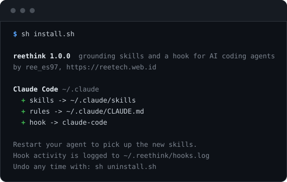
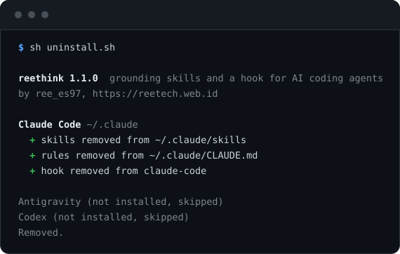

# reethink

**English** · [Bahasa Indonesia](README-ID.md)

Seven skills that make an AI coding agent check before it answers and say what
it found in a way a human can act on, plus the hook that turns them on without
being asked.

```sh
curl -fsSL https://raw.githubusercontent.com/masbrokemanaaja/reethink/main/install.sh | sh
```



The installer finds the agents already on your machine, copies the skills where
each one looks for them, adds a routing block to its instruction file, and
wires the hook where the agent supports one. Restart the agent and it is live,
though Claude Code was measured picking both up without one. On Codex, check
that the hook arrived: older versions hold a new one for review until you
approve it with `/hooks`, and the installer says so as it writes the entry.

Undo it at any time with `sh uninstall.sh`. Everything it wrote is marked, and
uninstall removes exactly that. The single thing it cannot put back is
whitespace: a JSON config is rewritten by a formatter, so it comes back
indented with two spaces, values untouched.

## What changes after you install it

Measured on a live Antigravity session, four questions asked once with it and
once without, same model and a fresh conversation each time:


| In four answers | With reethink | Without |
| --- | --- | --- |
| Claims labelled verified, assumed or untested | 17 | 0 |
| Citations naming a file and a line | 18 | 6 |
| Commands actually run to check something | 16 | 7 |

Every one of those citations was followed up by hand and none was fabricated.
The agent checked more than twice as often before answering, and said which
parts it had checked.

What did not change: both arms answered all four correctly. This does not stop
a capable agent being right, and the section further down gives the four
separate attempts to measure that, all of which came back flat, along with why.
The claim here is narrower and it is the one that held up: you can see where
the answer came from.

---

## The problem

A coding agent that is wrong in an obvious way is easy to catch. The expensive
failures are the quiet ones:

- It writes `client.foo()` because a method by that name feels right. The
  library has no such method, and the error surfaces three steps later.
- It tells you the latest version is the newest one it remembers, which was
  current when its training data was collected and is now two majors behind.
- It says a feature does not exist, when it shipped after the model's cutoff.
- It stops at "I'm not sure, check the documentation" while the documentation
  is one tool call away.
- It writes code that works and leaves the file a little harder to change,
  every time, until nobody can find where anything lives.
- It does the work correctly, then buries the one number that mattered under a
  paragraph of "I have successfully implemented the requested changes".

None of these is a knowledge problem. The model can find all of it. They are
**habit** problems, and habits are what skills are for.

## The skills

Each is a folder with a `SKILL.md` in the [Agent Skills open
standard](https://agentskills.io) format, so they load in any compatible tool.

Five of them decide what is true. Two decide what survives the trip to the
person reading. The second pair matters more than it looks: an agent that
measures carefully and then reports "it works now" has thrown the measurement
away at the last step.

### Deciding what is true

#### `grounded-research`

Stops the agent answering from memory, and stops it giving up.

Two failures matter equally: inventing a plausible API that does not exist, and
stopping at "I'm not sure" when the answer is a tool call away. The skill sets
a source ladder, the repository first, then a documentation MCP server if one
is attached, then the project's own primary source, with secondary sources
demoted to leads rather than evidence. It carries a "research without giving
up" section: when the obvious query returns nothing, change the vocabulary,
read the implementation, read the changelog around the version in use, search
the issue tracker, and only then report the gap.

> Uncertainty is the trigger to go and look, never the reason to stop or to
> hand the question back.

#### `stay-current`

Stops the agent answering out of a stale training horizon.

The error runs in both directions, and the second one is the one people miss:
claiming a remembered version is current, and claiming something does not exist
because it shipped after the cutoff. Memory is a floor, never a ceiling. The
skill carries the registry commands for npm, Go, PyPI and GitHub releases, and
two traps found while testing them: `gh api repos/.../tags` returns tags in no
documented order and not by date, so its first entry answers nothing, and a
package with LTS channels lists many `dist-tags` where only `dist-tags.latest`
answers "latest".

#### `modular-code-guard`

Keeps what gets written from turning into spaghetti.

Single responsibility, small units, separation of concerns, explicit module
boundaries, a dependency direction that points inward. It follows the
repository's existing structure rather than imposing a better one, and carries
a checklist to answer against the actual diff rather than from memory, plus a
section on proving a refactor did not change behaviour: baseline first, one
responsibility per step, re-run and compare, and say so plainly when a step is
unverified.

#### `security-assessment`

Guides white-box security audits, vulnerability triage, and defensive hardening.

Two failures defeat automated security assistance: writing weaponized exploit
payloads that trigger safety filters without helping anyone ship, and refusing
to inspect suspicious code out of excessive caution. The skill grounds security
tasks in source-to-sink taint analysis, recognized CWE and OWASP standards,
local security regression tests, and concrete remediation patches.

#### `senior-engineer`

The judgement layer: what a good solution looks like, and which option is worth
building at all.

Its centre is a "think out of the box" pass that runs before the design is
settled: attack the requirement rather than the ticket, ask whether the problem
can be deleted, invert it, move the work in time or space, steal from another
domain, find the constraint that is actually fake, and pick the cheapest
experiment that kills one option. Then state in one line which non-obvious
option was found and why it was or was not taken, because the boring solution
winning is also an answer. Guardrails keep the creativity in the framing and
out of the security, error handling, naming and style.

### Deciding what reaches the reader

These two apply to every reply rather than waiting for a trigger, and both stop
at the conversation: they govern replies, never the code, the documentation or
the commit messages, which stay as long as they need to be.

#### `concise-answers`

Fewer words carrying the same information, not fewer words carrying less.

The answer goes in the first sentence, and the padding goes: preambles, recaps
of the request, narrating which file is about to be opened, summaries of what
was just said. The important half is the floor underneath, the things brevity
is not allowed to take: measured numbers, the difference between verified and
assumed, caveats that change what the reader does, what was not checked, and
test output exactly as it happened. Length follows the question, so a yes or no
gets a line and a security finding gets as much room as it needs. The rule is
no padding, not a word cap.

#### `plain-technical`

Readable by a smart person outside the stack, still trusted by a specialist
inside it.

It names the five patterns that make technical writing stiff, each with a
mechanical fix: nouns doing the work of verbs, sentences with no actor, terms
used but never explained, abstract claims with nothing concrete attached, and
corporate register. What it will not do is simplify by deletion. The real term
stays, next to the plain description, because the non-specialist needs a word
to search for and the specialist needs it to know what you actually built.
Numbers never become adjectives, and identifiers never disappear. A clear
explanation is sometimes longer than the stiff one, which is why this is a
separate skill from the one above rather than a section inside it.

## The hook

Skills activate when the agent decides their description matches. That is a
judgement it makes every turn, and it is not free.

The hook removes the judgement from the first turn. Before the model runs, it
injects a short reminder: the local time is already in the message metadata so
do not spend a command on `date`, treat memory as a floor, check the installed
version before stating any API, load the grounding skills when they
apply, and keep every reply dense and plainly written. One injection per turn,
about 1,557 characters, nothing after that.

```
Claude Code   UserPromptSubmit  ->  hookSpecificOutput.additionalContext
Codex         UserPromptSubmit  ->  hookSpecificOutput.additionalContext
Antigravity   PreInvocation     ->  injectSteps[].ephemeralMessage
```

Three hosts, two contracts: Claude Code and Codex agree down to the nesting, so
one branch answers both and only the file the entry goes into differs. An
unrecognised payload gets `{}`, which every host reads as "do nothing". That is
the correct failure: a grounding reminder is worth having, but never worth
breaking someone's agent over.

Every run appends a line to `~/.reethink/hooks.log`, so you can prove it fired
instead of assuming. The line names the contract rather than the product,
because two of the hosts send the same payload and the script cannot tell them
apart:

```
2026-09-16T16:07:25 UserPromptSubmit session=abc12345 injected=True
2026-09-16T16:07:25 PreInvocation conversation=f746564c invocationNum=0 injected=True
2026-09-16T16:07:25 PreInvocation conversation=f746564c invocationNum=1 injected=False
2026-09-16T16:07:25 wrapper: no injection, python3 exited 1 with no message
```

The log keeps one generation: past a megabyte it rolls to `hooks.log.1`.

The first-call rule is worth what it saves. Over thirteen minutes of one real
Antigravity session the hook ran 97 times and injected 7 times, once at the
opening of each turn, with no run failing. The longest single turn made 42
model calls: without the rule the same 1,557 characters would have gone in 42
times. Every injection landed on `invocationNum=0`, which is the contract
Antigravity documents and the reason the script compares against it instead of
trying to learn the numbering.

Claude Code was watched the same way, across three sessions: one line in the
log per user message, the reminder visible in the turn it was attached to, and
no failed run. Both products picked up the skills and the hook without being
restarted, so the line above about restarting is the safe advice rather than a
requirement; restart if something looks missing.

## Supported agents

| Agent | Skills | Rules | Hook | Tested |
| --- | --- | --- | --- | --- |
| Claude Code | `~/.claude/skills/` | `~/.claude/CLAUDE.md` | `UserPromptSubmit` | yes |
| Antigravity | `~/.gemini/config/skills/` | `~/.gemini/GEMINI.md` | `PreInvocation` | yes |
| Gemini CLI | `~/.gemini/skills/` | `~/.gemini/GEMINI.md` | none | paths only |
| Codex | `~/.codex/skills/` | `~/.codex/AGENTS.md` | `UserPromptSubmit` | yes |
| Shared alias | `~/.agents/skills/` | none | none | yes |
| Cursor | `~/.cursor/skills/` | none | none | paths only |

Google ships three of these and they do not share a layout. Antigravity and
Antigravity IDE both read `~/.gemini/config/`, so one row covers them both;
the `~/.gemini/antigravity/` and `~/.gemini/antigravity-ide/` directories
beside it hold per-app state, with no skills and no hooks in either. Gemini
CLI is a third product in the same tree with its own `~/.gemini/skills/`, and
because `~/.gemini/` exists the moment Antigravity does, what proves Gemini
CLI is installed is `~/.gemini/settings.json`. The two share
`~/.gemini/GEMINI.md`, and since the block sits between markers, a machine
with both ends up with one copy.

The last two rows are not agents. `~/.agents/skills/` is the cross-tool alias:
Gemini CLI documents it beside `~/.gemini/skills/`, Codex documents it as its
user scope, and Cursor lists it too, so installing there reaches all three
without a row each. Codex was measured loading skills from it. `~/.cursor/`
is Cursor's own directory, taken from its documentation and not yet exercised
on a machine with Cursor on it. Neither has a global instruction file this
package has verified, so neither gets a rules block or a hook, and the
installer says so as it skips them.

"Tested" means the install, the re-install, and the uninstall were run against
that agent's real config layout and the result inspected, not that every path
was read from a document and hoped for. It does not mean the hook was watched
firing inside that product. All three have had that done now: Antigravity and
Claude Code from the sessions counted in the hook section above, and Codex on
0.154.0, both interactively and through `codex exec`.

One note on the Codex hook, which is the only part of any row that has moved
under measurement. Codex trusts hooks by hash, and its documentation says
"Before a non-managed hook can run, Codex requires you to review and trust the
exact hook definition", with new or changed hooks "marked for review and
skipped until trusted". Skipped, and nothing said about it.

On **0.147.0** that is exactly what happened: installed the ordinary way, the
hook did not fire across three `codex exec` turns, and waiving trust for one
run with `--dangerously-bypass-hook-trust` made the same entry fire. So the
entry and the reply were right and approval was the only thing missing.

On **0.154.0**, twelve minor versions later, the same install fires with no
approval at all. `/hooks` lists it as installed and active straight away, and
it injects on the first message, in the interactive session and through `codex
exec` alike. Whether the requirement was dropped or only narrowed is not
something this repository has established.

So the installer tells you how to check rather than what will happen:

```
! Codex may hold a new hook for review: if the reminder does not arrive, run /hooks in Codex and approve reethink
```

Claude Code and Antigravity have never needed that step.

**Any other Agent Skills tool.** Around forty products implement the standard,
including Cursor, GitHub Copilot, VS Code, Gemini CLI, OpenCode, Goose, Kiro,
Roo Code, Amp and Factory. The skills work in all of them unchanged; only the
installer does not know their paths yet. Copy `skills/*` into the tool's skills
directory and paste `rules/routing.md` into its instruction file.

Cursor needs less of that than most: its documentation says it also loads
`~/.claude/skills/` and `~/.codex/skills/` for compatibility, and the installer
now writes `~/.cursor/skills/` and the shared `~/.agents/skills/` as well. Only
the routing block still has to be pasted by hand. A pull
request adding your agent to the table is welcome, with the paths verified on
a real machine rather than taken from a page.

## Installing as a plugin instead

The installer is one way in. Three agents also take this repository as a
plugin, which is the path to use if you would rather their own tooling managed
it than a shell script wrote to your dotfiles.

```sh
# Claude Code
claude plugin marketplace add masbrokemanaaja/reethink
claude plugin install reethink@reethink

# Codex
codex plugin marketplace add masbrokemanaaja/reethink
codex plugin add reethink@reethink
```

Cursor imports a marketplace from a repository through Dashboard, Plugins,
Add Marketplace, Import from Repo.

What a plugin install carries depends on the agent, and the difference was
measured rather than assumed.

On **Claude Code** it carries the skills and the hook. The plugin ships
`hooks/hooks.json` pointing at `${CLAUDE_PLUGIN_ROOT}/hooks/reethink-grounding.sh`,
and a session started against a freshly installed plugin wrote
`UserPromptSubmit session=... injected=True` to the log before it had even
finished authenticating. The routing block is the only piece the installer
still has to write.

On **Codex** it carries the skills alone. `codex features list` reports
`plugin_hooks` as `removed`, so a Codex plugin cannot register a hook whatever
its manifest says.

Running both roads for one agent is the thing to avoid. Two copies of every
skill, and on Claude Code two hooks firing, which means the same 1,557
characters injected twice per turn. Pick one per agent.

The manifests are `.claude-plugin/plugin.json` and its `marketplace.json`,
`.codex-plugin/plugin.json` with `.agents/plugins/marketplace.json`, and
`.cursor-plugin/plugin.json`. The two Claude ones pass `claude plugin validate
--strict`. The Codex pair was measured: `codex plugin marketplace add` against
a local clone registered it and `codex plugin list` showed
`reethink@reethink`. The Cursor one follows its documented fields and has not
been run on a machine with Cursor installed.

## Install options

```sh
sh install.sh                    # everything it can, for every agent found
sh install.sh --dry-run          # print the plan, change nothing
sh install.sh --list             # what is detected and what is already installed
sh install.sh --skills-only      # skip the rules block and the hook
sh install.sh --agent claude-code   # or codex, antigravity, gemini-cli, agents-dir, cursor
sh install.sh --version          # print the version and exit
sh uninstall.sh                  # remove all of it
```

The curl one-liner takes whatever is on `main`. To pin it, set `REETHINK_REF`
to a tag or a branch:

```sh
curl -fsSL https://raw.githubusercontent.com/masbrokemanaaja/reethink/main/install.sh \
  | REETHINK_REF=<tag-or-branch> sh
```

The ref has to exist in the repository. `main` is the moving target and
`v1.0.0` is the first release tag.

## What it writes, and how to get rid of it


Every change is marked and reversible.

**Skills** are six folders under the agent's skills directory. Uninstall
removes those six folders and nothing beside them.

**Rules** go into the agent's instruction file between two markers:

```markdown
<!-- reethink:start -->
...routing block...
<!-- reethink:end -->
```

Re-running replaces what is between the markers where they stand and leaves
the rest of the file alone, byte for byte, including anything you wrote below
the block. The test suite checks this against a file with headings, blank
lines and an indented code block, and CI runs that suite on Linux and macOS.
The one change to the rest of the file happens on the first install only:
trailing blank lines at the end are normalised so repeat runs cannot grow it.

A start marker with no matching end marker is not treated as a block. The
installer says so and writes nothing, rather than reading to the end of the
file and taking your text with it.

The two hook scripts live in one shared `~/.reethink/`, and every agent's
entry points at them, so uninstalling one agent leaves them in place while any
other agent still does. They go with the last one out. The log stays either
way.



**Hooks** are merged into the agent's JSON config, never written over it. Your
own hooks on the same event stay where they are; ours is added beside them and
carries the `reethink` path so uninstall can find exactly it. If the config is
not valid JSON, or is valid but not the shape this expects, the installer says
which and leaves it untouched rather than replacing it. All of this is covered
by the test suite.

One thing does change beyond our entry: the file is written back by a JSON
formatter, so it comes out indented with two spaces. Every setting keeps its
value, non-ASCII stays a character rather than a `\uXXXX` escape, and a config
already formatted that way comes back with only our entry added.

## What it costs, and what it changed

Both halves of this are measured, and the second half is not the result the
project set out to find.

### The cost

| | |
| --- | --- |
| Loaded at startup, seven names and descriptions | 5,109 characters |
| The routing block, in the instruction file | 2,060 characters |
| The hook injection, once per turn | 1,557 characters |
| Fixed per turn | 3,617 characters |
| One hook run | 25 ms, from ten runs in 247 ms |
| Hook failures | 0 in 205 logged calls, 67 of them injections |

### Measuring whether the answers get better

Four attempts, none of which found a difference in whether answers were right.

The first three ran the suite in `evals/` through `claude plugin eval`, which
resolves this repository as a plugin and adds a no-plugin baseline arm on its
own. Eight cases, three runs per arm.

| Run | Mean delta |
| --- | --- |
| Opus, first graders | +0.17 |
| Opus, corrected graders | -0.08 |
| Haiku 4.5, corrected graders | -0.00 |

The sign moved with the grader wording and with the model, which is what a
measurement looks like when the noise is larger than the effect. Reading the
transcripts explained why: in every run most cases scored 3 out of 3 in both
arms. The eval sandbox has no repository on disk, so each case has to paste its
own evidence into the prompt, and a case reduced to "read what is in front of
you" is one both Opus and Haiku already pass. The behaviours the skills exist
for, going to the registry, reading the installed version, opening the primary
source, were never exercised.

The fourth ran by hand in Antigravity, where the agent has real tools and a
real workspace, and where the whole package is live rather than the skills
alone. Four questions, each asked once with reethink installed and once with it
removed, same model, new conversation each time. The protocol is in
[evals/manual](evals/manual/README.md).

Both arms answered all four correctly. The difference was somewhere else:

| In four answers | With reethink | Without |
| --- | --- | --- |
| Claims labelled verified, assumed or untested | 17 | 0 |
| Citations naming a file and line | 18 | 6 |
| Commands actually run to check something | 16 | 7 |

So the honest claim is not that it stops an agent being wrong. On these
questions a current agent was not wrong either way. What changed is that every
claim came back with its verification status attached and a source named, and
the agent checked more than twice as often before answering. Every one of those
citations was followed up by hand and none was fabricated, in either arm.

### What that is not

Four questions asked once each is an observation, not a statistic. The machine
it ran on had twelve other skills installed that stayed active in both arms, so
the comparison is reethink on top of an existing setup against that setup
alone, not against a bare agent. One of the four questions had its answer
written in this repository's own README, which the agent had open, so that case
did not test what it was meant to. And checking more often costs tokens and
time; the extra nine commands are a price, not only a benefit.

The suite ships so the next person can do better than this. `evals/README.md`
says what each case looks for and what it would take to build cases that
separate the arms.

## Verify it yourself

```sh
git clone https://github.com/masbrokemanaaja/reethink
cd reethink
sh test/run.sh
```

The suite installs into a temporary `HOME`, so it never touches your real
configuration. It runs 85 checks: the skills validate against the spec and are
all named in the routing block and the hook message, the hook script answers
both host contracts and survives malformed input, the rules block is idempotent
and leaves the user's own text where and as it was written, a damaged marker
pair is refused rather than acted on, an unknown `--agent` name fails loudly,
the version number reads the same in all fifteen places it is written, and an
install followed by an uninstall gives the files back byte for byte.

## Why these seven, and not more

Every skill in the list is paid for on every turn: an agent loads each skill's
name and description at startup to decide what is relevant. A large library of
overlapping skills makes that decision worse, not better. These seven divide
cleanly along one question each:

- **grounded-research**: is this true?
- **stay-current**: is it still true?
- **modular-code-guard**: is the code going to stay workable?
- **security-assessment**: can untrusted input reach something that matters?
- **senior-engineer**: is this the right thing to build?
- **concise-answers**: did the answer survive being written down?
- **plain-technical**: can the person reading it act on it?

An eighth would have to answer a question none of these does. The seventh
earned its place the same way: none of the other six asks where untrusted
input goes, and the two failures it targets are opposite ones, writing a
weaponised payload and refusing to look at suspicious code at all.

That is the whole difference from the collections. The large ones are large on
purpose: catalogues of 380, 1,000, even 2,115 skills, sorted by domain. They
are useful when you know the name of the thing you want. This is not that. Seven
skills cost 5,109 characters of context at startup, measured; a thousand
descriptions cost that many times over in every session, and they crowd the
one decision the agent has to make each turn, which is whether any of them is
relevant right now.

Two other things follow from being small. A collection ships skills and leaves
the loading to chance; this ships a hook as well, so the grounding arrives on
the first turn rather than when the agent happens to notice a description
matches. And a collection is copied by hand; this is installed by one command
that knows six targets' paths, writes only between markers, and comes back out
with `sh uninstall.sh` leaving the file it touched byte for byte as it was.

The last difference is the one this file is made of. Every claim here carries
the version it was measured against and the date. The check count and the
length of the injected message are read back out of this README by the test
suite, so a number here cannot drift away from the code without a red run.

## Contributing

The house rules are in [AGENTS.md](AGENTS.md); [CONTRIBUTING.md](CONTRIBUTING.md)
covers getting a change in. There is an issue form for the case this package is
about: a claim in here that was true when it was measured and is not any more.
Security reports go through GitHub's private vulnerability reporting, described
in [SECURITY.md](SECURITY.md).

## Licence

MIT. Use it, change it, ship it.

Built by [ree_es97](https://reetech.web.id).
